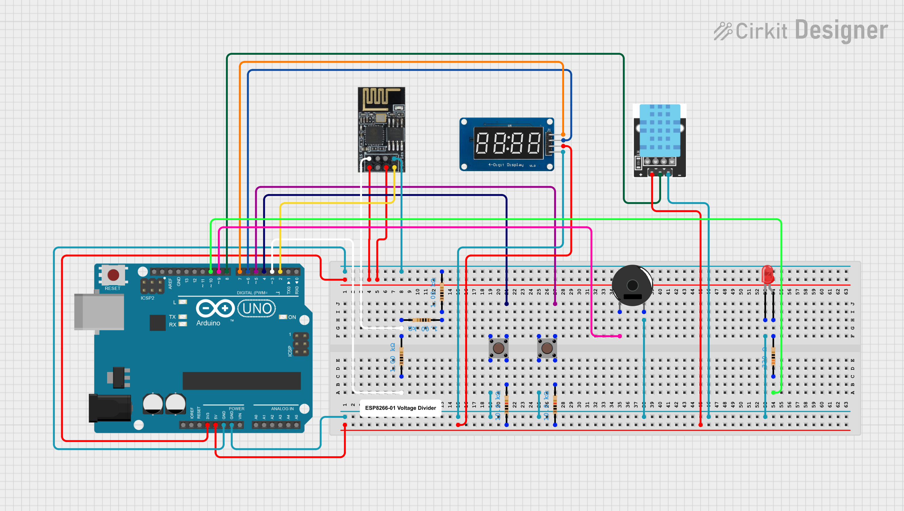
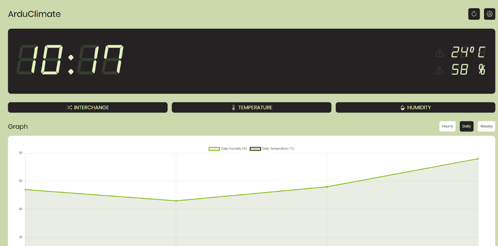
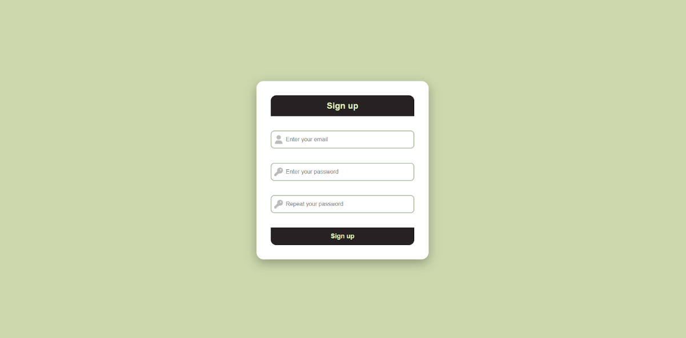
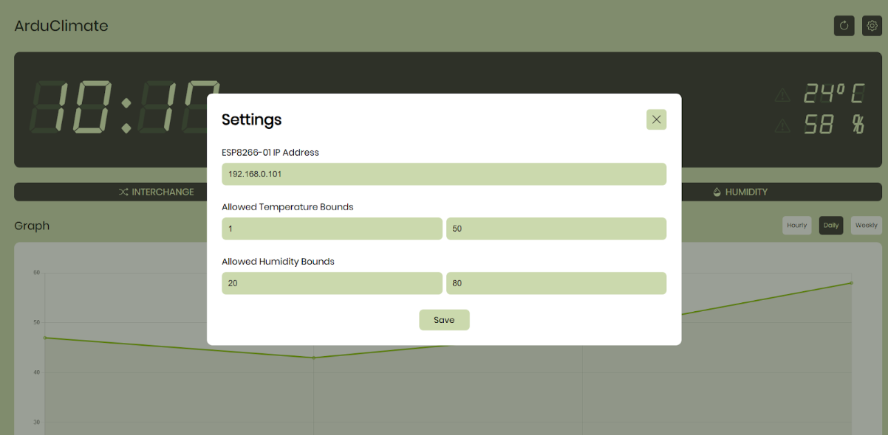

ArduClimate
===========

An Arduino-controlled temperature and humidity monitoring system connected to a website interface via WiFi. For my IoT class.

# Table of Contents
1. [Features](#features)
1. [Components](#components)
1. [Website Interface](#website-interface)

# Features
* Collect temperature and humidity readings over a user-defined interval in real-time.
* Display current temperature/humidity on a seven-segment display.
* Upload readings to the web server via the WiFi module.
* Alert user when readings exceed predefined bounds with flashing LED and buzzer.
* Allow users to interact with the system directly with hardware controls.
* And many more (probably :vv)

# Components
| Component | Quantity |
| --------- | -------- |
| Arduino Uno R3 | x 1 |
| TM1637 Seven Segment Display | x 1 |
| DHT11 Temperature and Humidity Sensor | x 1 |
| ESP8266-01 WiFi Module | x 1 |
| Four-leg Push Buttons | x 1 |
| 5V Buzzer | x 1 |
| 10K Resistor | x 2 |
| 1K Resistor | x 3 |
| LED | x 1 |

# Website Interface
The webserver is built with Spring Boot and Spring Data JPA while the client-side interface is built with plain HTML, CSS, and JavaScript with the add-on of the Chart.js library.

